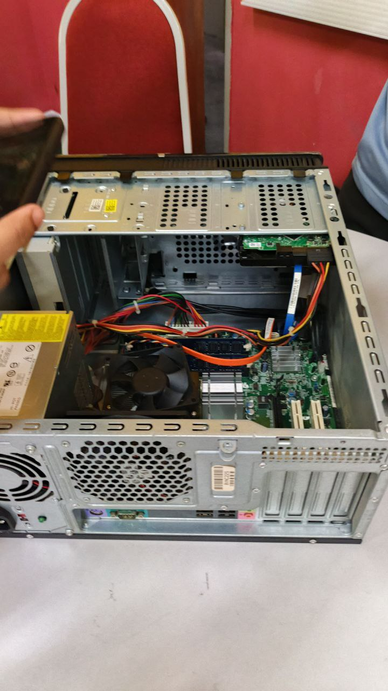

# 🧪 Lab 1: PC Assembly and Disassembly
### Universiti Teknologi Malaysia

| 🕒 Time | 📅 Date |
| :---: | :---: |
| **4:00pm - 5:00pm** | **30 October 2025** |

---

## 📝 Session Summary
Our first lab focused on the practical side of computer hardware. Following a detailed demonstration by the lecturer on safe handling techniques, we worked in groups to disassemble and reassemble a Personal Computer. We got hands-on experience with sensitive components like the motherboard, RAM, and hard disk, ensuring the system could boot successfully after reassembly. The session concluded with a quiz to gauge our understanding of the components and procedures.

---

## 💭 Reflection

### 💡 Key Highlights
* **🛠️ From Theory to Reality:** Being a first-year student, this lab was a revealing experience. It was my first opportunity to actually open a computer case and examine the internal components closely. Watching the slides is one thing, but holding the motherboard and RAM makes the concepts click in a completely different way.
* **🤝 Learning Through Teamwork:** Working in a group of six taught me a lot about coordination. We had to be patient and communicate clearly to make sure we didn't break anything. It was satisfying to see the theoretical material translate into a real activity where we had to ensure the PC actually booted up at the end.
* **🧠 Learning Style Discovery:** I discovered that I learn best by doing. Inspecting and installing the parts myself helped me understand how the system works together much better than just reading about it.

### 📈 Suggestions for Improvement
* **More Individual Time:** Since the groups were quite large, not everyone got to handle every component. I think allocating more time or having smaller groups would ensure every student gets the full hands-on experience.
* **Troubleshooting Challenge:** It would be really cool if the lab included a specific "fixing" segment. For example, if the instructor purposely loosened a cable or the RAM, and we had to figure out why the PC wouldn't boot. That would build real-world problem-solving skills.

---

## 📷 Photo Highlights
Here are some moments captured during our hands-on session.

| **PC Assembly** |
| :---: |
|  |

