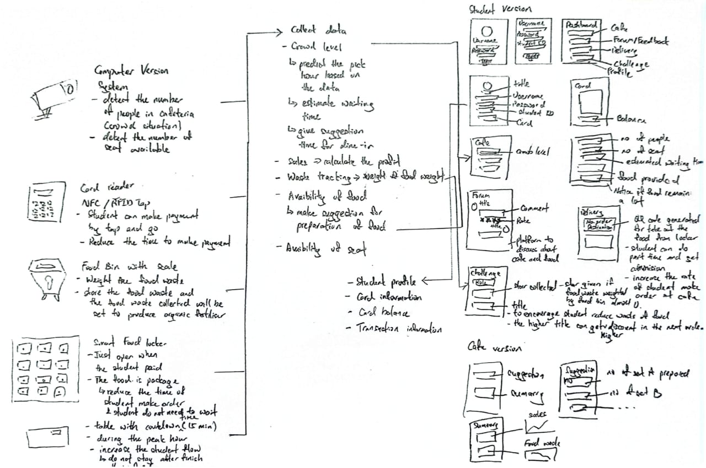

# 🧠 Project: Design Thinking 
### Universiti Teknologi Malaysia

| 👥 Group Name | 📅 Date |
| :---: | :---: |
| **DataVenture** | **20 November - 31 December** |

---

## 👥 Team Members
* **Farah Adilah**
* **Edwin Wong**
* **Faruq Jazli**

---

## 📌 Project Summary: UniFlow
For this project, we tackled a common struggle at the UTM cafeteria which is the lack of seats during peak hours and the alarming amount of food waste. We developed **UniFlow**, a smart application designed to smooth out the cafeteria experience.

* **The Problem**
    We found that students were stressed out trying to find seats between 1 PM and 2 PM. On top of that, cafe owners were losing money because of food waste and inefficient crowd management.

* **Our Solution**
    We followed the Design Thinking process (Empathize, Define, Ideate, Prototype, Test) to create a comprehensive system. We interviewed students and staff to really understand their pain points before writing a single line of code.

## 🔑 Key Features

* 📱 **UniFlow Mobile App**
    The central hub where students can check real-time crowd levels, pre-order meals to skip lines, and view seat availability. It also helps cafe owners track sales and waste data.

* 📷 **AI-Driven Camera System**
    This detects empty seats and notifies students via the app so they know exactly where to sit without wandering around.

* 🔐 **Smart Food Lockers**
    A "Buy & Go" system where students pre-order meals and pick them up from a secured locker to skip the long queues.

* ♻️ **Smart Waste Bins**
    To tackle waste, we designed a bin with a scale. It gamifies the experience by awarding points to students who finish their food, which helps convert waste into organic fertilizer.
---

## 📝 Reflection

> "This project really shifted my perspective. Before this, I honestly thought my degree was just about writing code and managing databases. But Design Thinking taught me that we have to understand the human side of the problem first.
>
> We realized that it does not matter how advanced the technology is if it does not solve the user's actual stress. Moving from just 'coding' to 'problem-solving' was a big step for me. It helped me see that to be a successful Data Engineer in the future, I need to build systems that are not just technically strong but also practical for the people using them. It is about empathy just as much as it is about logic."

---

## 🎥 Video Assignment
Here is our video presentation explaining the Design Thinking process behind UniFlow.

<a href="https://www.youtube.com/watch?v=8ATcdtBz3I4">
   
</a>

 
<b>Click the image above to watch the video</b>

---

## 🔧 Features & Prototype
Here are the key components of our solution.

**The Prototype App Design**
 

 
<b>Click the button above to view the app design</b>

 
 

**Ideation Sketches**
 

---

## ☁️ Project Report

<table width="100%">
<tr>
<td align="center">

 
<b>Click above to download the full documentation</b>
</td>
</tr>
</table>

